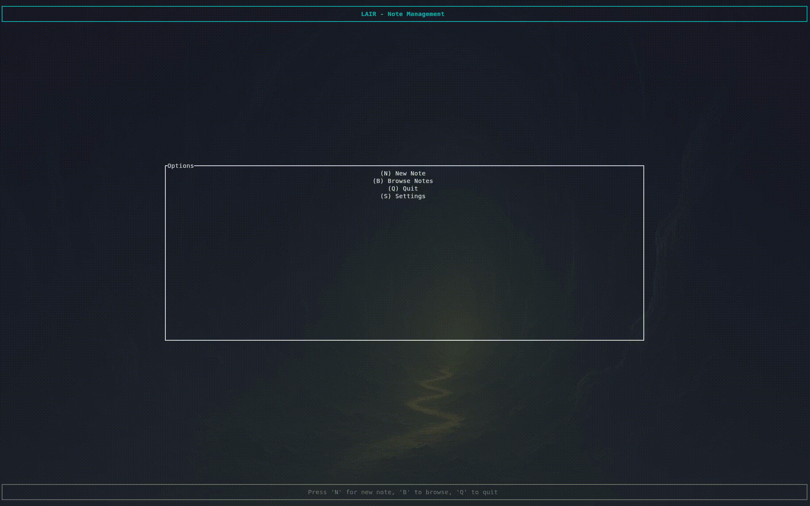
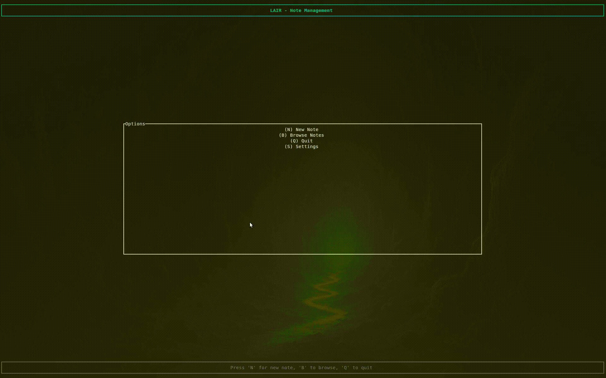

# Lair

this project serves as an abstraction and management layer above neovim, intended for taking and organising notes.
the intention being, I take a lot of notes, and I don't often consider where to save them - or sensible names.
I will have a meeting, and save my lengthy messy notes under `Architecture_meeting_notes.md` in whatever directory I was in last. Dreadful. I know.

This is a rust TUI, intended to present a framework in which you can open a new note, write it using nvim, and have it be saved to a central location.

# New note

The new note page has a few features. When you make a new note, it will automatically be saved into a directory for today's date. Dunno if that's great for everyone - but it is for me!
If you don't provide a file name, it'll just use `notes_for_<timestamp>`.

When you exit your editor of choice, you get booted back to the Lair main menu.

# Browse

Browse is arguably where the magic happens, and is the ugliest part of the code base (in my opinion?)
you can expand folders recursively, open files, and create new files.

## Search
Lair provides two search modes:
### Fuzzy search (accessed by hitting `/`):
- Recursive fuzzy search against all file titles
- Ignores directories, only goes off files
### Live grep (accessed by hitting `?`):
- Queries the contents of the files in the notes directory
- Shows a small preview as to where the match occurs
- Not case sensitive

# Settings

Very barebones settings page.
- Notes directory: This is the root dir for where all your notes should live.
- Editor: This is for your editor of choice, it will just call whatever you put in this box. Hasn't been tested with GUI editors. Nvim or bust.
- File format: Default is .md, but you can set this to whatever, it just determines what it whacks on the end of a file, if you don't specify an extension.

# Install
as it stands, I don't really plan on including a release binary in this repo, so build from source!

### Dependencies
- rust: use rustup to install it, find how here: https://rustup.rs/

### Building
- `git clone https://github.com/f5aaff/lair`
- `cd lair`
- `cargo build --release`

